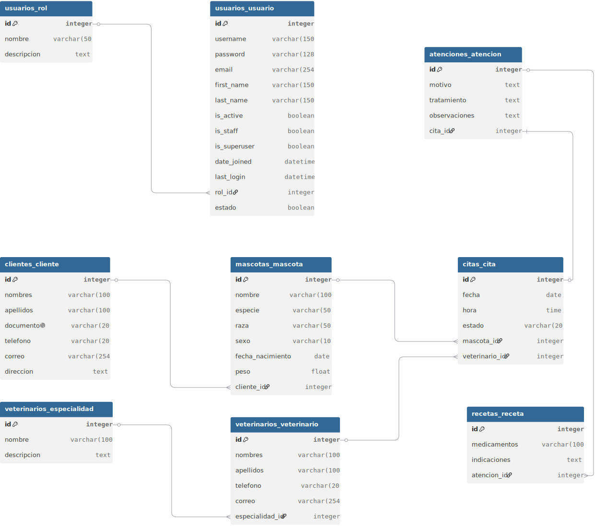
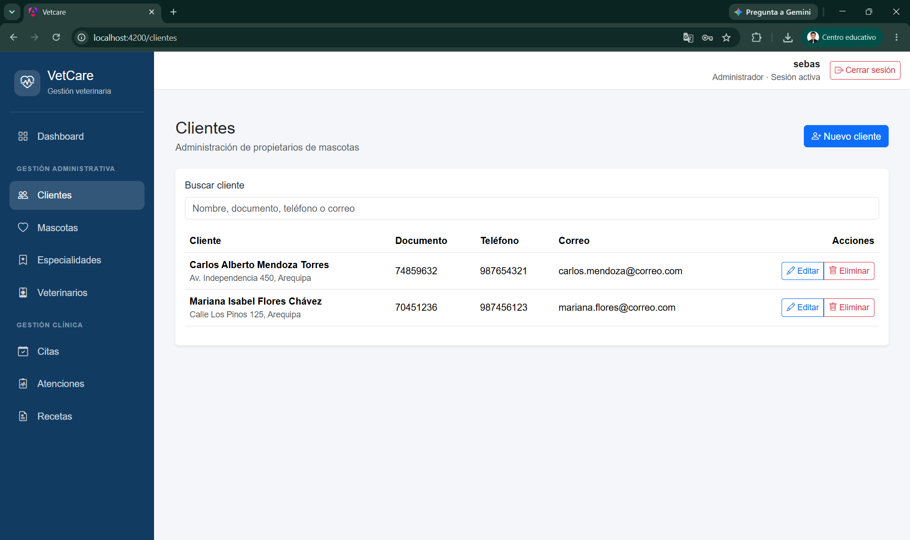
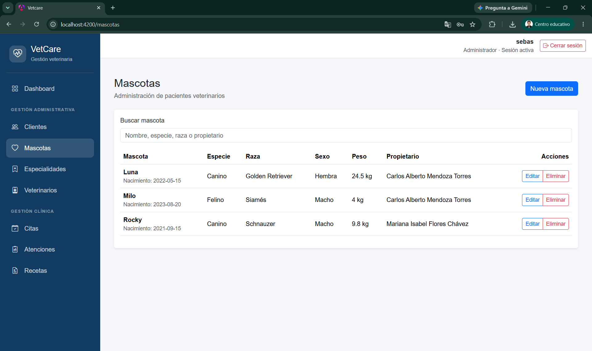
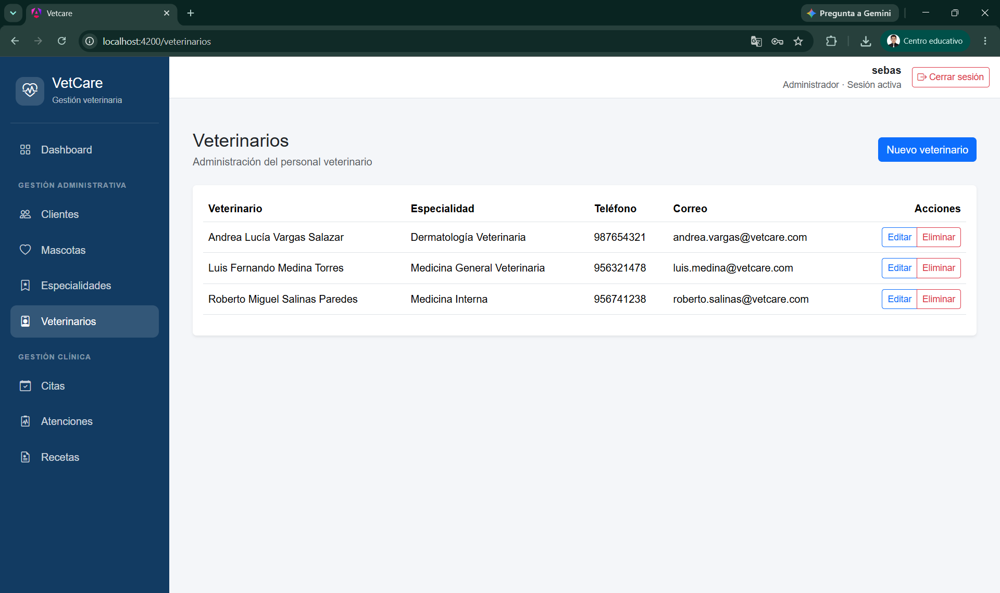
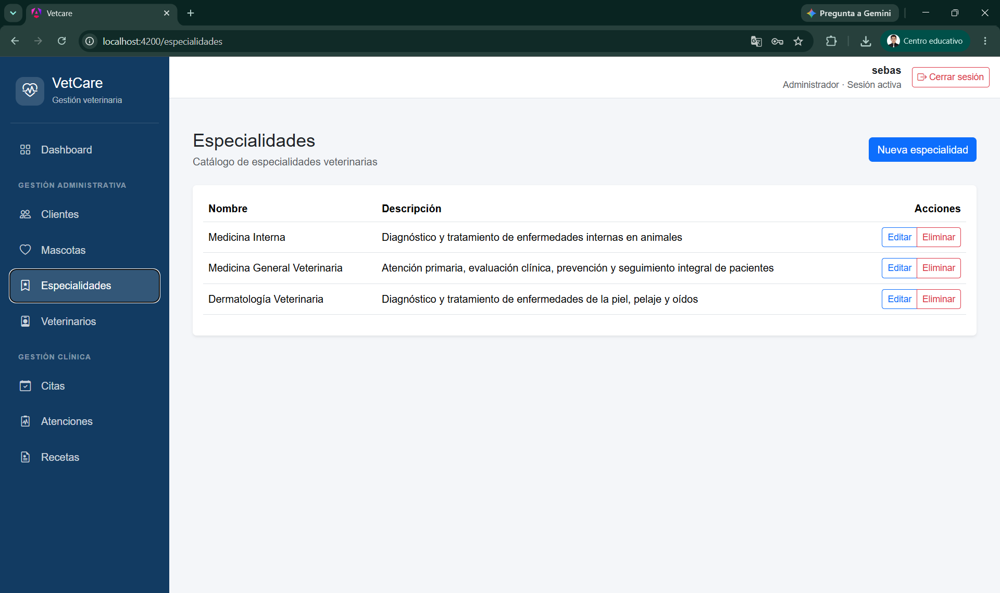
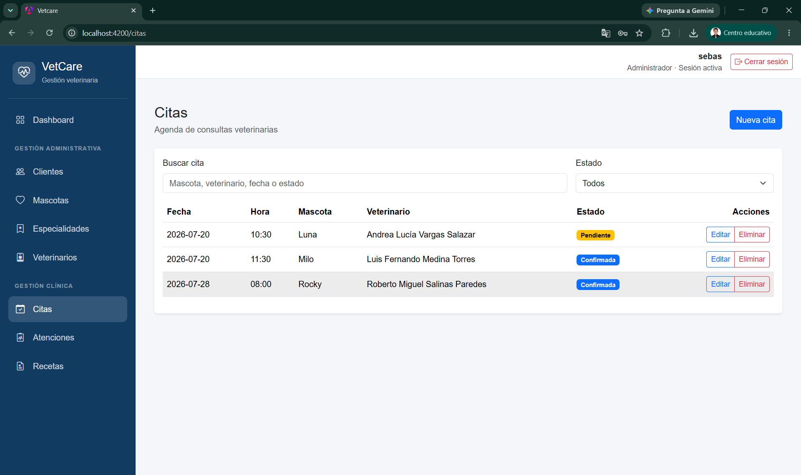
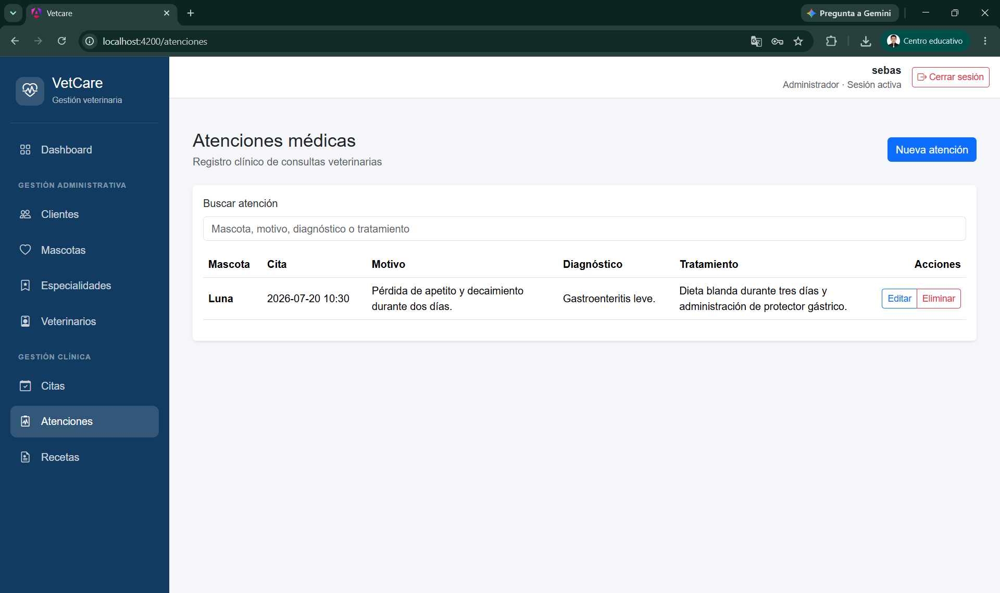
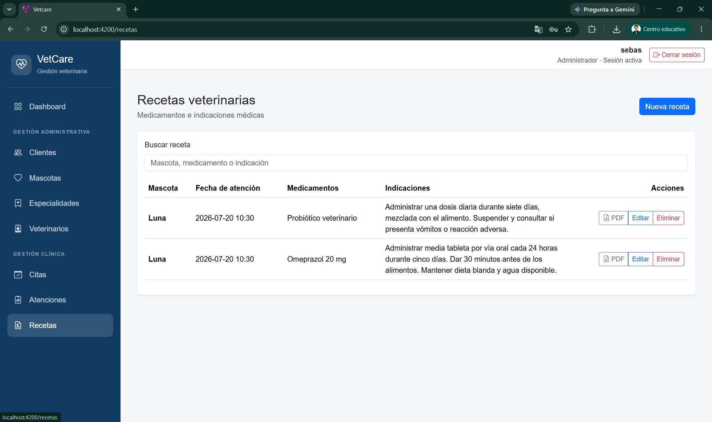

# VetCare - Sistema Integral de Gestión para Clínicas Veterinarias

> Proyecto Final del curso **Desarrollo de Aplicaciones Web**  
> Universidad Nacional de San Agustín de Arequipa

---

# Videos de presentación

**Video demostrativo**  
**Enlace:** https://www.youtube.com/watch?v=osHdvny-EPU&feature=youtu.be

**Video resumen**  
**Enlace:** https://www.youtube.com/watch?v=fim1jxEGrjo&feature=youtu.be

---

# Integrantes

- Sebastian Donato Ulloa Salas
- Diego Aristides Cervantes Apaza
- Basily Andree Castellanos Ampuero

**Docente:** M.Sc. Carlo Jose Luis Corrales Delgado

---

# Introducción

La transformación digital ha permitido optimizar significativamente la gestión de organizaciones en distintos sectores, incluyendo el ámbito de la salud veterinaria. Sin embargo, muchas clínicas continúan administrando la información de clientes, mascotas, citas e historiales clínicos mediante registros físicos o herramientas poco integradas, dificultando el acceso oportuno a la información y aumentando el riesgo de errores administrativos.

VetCare surge como una solución web orientada a la gestión integral de clínicas veterinarias, centralizando la información clínica y administrativa dentro de una única plataforma. El sistema fue desarrollado siguiendo una arquitectura cliente-servidor basada en una API REST, implementando un backend con Django y Django REST Framework y un frontend desarrollado con Angular. La persistencia de la información se realiza mediante PostgreSQL y todo el entorno fue estandarizado utilizando Docker Compose.

El proyecto integra los conocimientos adquiridos durante el curso de Desarrollo de Aplicaciones Web, aplicando buenas prácticas de arquitectura de software, desarrollo colaborativo, consumo de servicios REST, autenticación mediante JWT y control de versiones con Git.

---

# Objetivo General

Desarrollar una aplicación web que permita gestionar integralmente los procesos administrativos y clínicos de una clínica veterinaria mediante una arquitectura basada en API REST utilizando Django, Angular y PostgreSQL.

# Objetivos Específicos

- Implementar autenticación segura mediante JWT.
- Gestionar clientes y mascotas.
- Administrar veterinarios y especialidades.
- Gestionar citas médicas.
- Registrar atenciones clínicas.
- Gestionar recetas veterinarias.
- Mantener el historial clínico de cada mascota.
- Consumir servicios REST desde Angular.
- Estandarizar el entorno mediante Docker.

---

# Descripción General

VetCare integra en una única plataforma los procesos principales de una clínica veterinaria. Permite registrar propietarios, administrar pacientes veterinarios, programar citas, registrar diagnósticos y tratamientos, generar recetas y mantener organizada toda la información clínica.

Su arquitectura desacoplada facilita el mantenimiento, la escalabilidad y la incorporación de nuevos módulos en futuras versiones.

---

# Problemática

Las clínicas veterinarias de pequeña y mediana escala suelen presentar problemas derivados del manejo manual de la información:

- Pérdida o duplicidad de registros.
- Dificultad para consultar historiales clínicos.
- Organización ineficiente de citas.
- Seguimiento limitado de tratamientos.
- Procesos administrativos lentos.

VetCare centraliza toda la información y automatiza los procesos principales para reducir estos problemas.

---

# Justificación

El desarrollo de VetCare permite aplicar tecnologías modernas para resolver una problemática real. Además de mejorar la organización de una clínica veterinaria, el proyecto integra conceptos de desarrollo backend, frontend, bases de datos, APIs REST, Docker y trabajo colaborativo mediante Git.

---

# Alcance

El sistema implementa los módulos principales para la gestión de una clínica veterinaria:

- Autenticación
- Clientes
- Mascotas
- Veterinarios
- Especialidades
- Citas
- Atenciones
- Recetas

Cada módulo dispone de operaciones CRUD y está integrado con el resto del sistema mediante relaciones en la base de datos.

---

# Características Principales

- Arquitectura Cliente-Servidor.
- API REST.
- Autenticación JWT.
- Base de datos PostgreSQL.
- Frontend SPA desarrollado en Angular.
- Backend desarrollado con Django REST Framework.
- Contenedores Docker.
- Interfaz responsive.

---

# Arquitectura del Sistema

```text
Usuario
   │
 Navegador
   │
 Angular
   │ HTTP / JSON
Django REST Framework
   │
PostgreSQL
```

El backend concentra la lógica de negocio, autenticación y acceso a datos, mientras que Angular implementa la interfaz gráfica y consume la API REST.

---

# Tecnologías

| Categoría | Tecnologías |
|-----------|-------------|
| Backend | Python, Django, Django REST Framework |
| Frontend | Angular, TypeScript, HTML5, CSS3, Bootstrap |
| Base de datos | PostgreSQL |
| Contenedores | Docker, Docker Compose |
| Herramientas | Git, GitHub, VS Code, Postman |

---

# Metodología de Desarrollo

Se empleó una metodología incremental basada en funcionalidades. El trabajo colaborativo se realizó mediante GitHub utilizando las ramas:

- main
- develop
- feature/vetcare

Docker permitió mantener un entorno homogéneo entre todos los integrantes.

---

# Estructura del Repositorio

```text
VetCare/
├── backend/
├── frontend/
├── img/
├── docker-compose.yml
├── README.md
└── .gitignore
```

---

# Modelo de Datos

Entidades principales:

- Rol
- Usuario
- Cliente
- Mascota
- Especialidad
- Veterinario
- Cita
- Atención
- Receta

Relaciones implementadas:

- Rol → Usuario (1:N)
- Cliente → Mascota (1:N)
- Especialidad → Veterinario (1:N)
- Mascota → Cita (1:N)
- Veterinario → Cita (1:N)
- Cita → Atención (1:1)
- Atención → Receta (1:N)

---

# Diagrama Entidad Relación



---

# Flujo Principal

Inicio de sesión → Registro del cliente → Registro de mascota → Programación de cita → Atención veterinaria → Diagnóstico → Tratamiento → Receta

---

# Descripción de los Módulos

## Autenticación

Controla el acceso mediante JWT, garantizando que únicamente usuarios autenticados puedan acceder a la información.

## Clientes

Permite registrar, consultar, actualizar y eliminar propietarios de mascotas.



## Mascotas

Administra la información clínica y general de cada paciente veterinario.



## Veterinarios

Gestiona el personal veterinario y sus especialidades.



## Especialidades

Administra las especialidades médicas disponibles.



## Citas

Permite registrar, consultar y administrar la programación de consultas.



## Atenciones

Registra diagnósticos, tratamientos y observaciones médicas.



## Recetas

Gestiona las indicaciones médicas derivadas de una atención.



---

# Capturas del Sistema

```
img/login.png
img/dashboard.png
img/clientes.png
img/mascotas.png
img/veterinarios.png
img/especialidades.png
img/citas.png
img/atenciones.png
img/recetas.png
```

---

# Instalación

## Clonar

```bash
git clone <URL_REPOSITORIO>
cd daw-grupal
```

## Configurar

```bash
cp .env.example .env
```

## Ejecutar

```bash
docker compose up --build
```

## Acceso

Frontend

```
http://localhost:4200
```

Backend

```
http://localhost:8000
```

---

# Consideraciones Técnicas

- Arquitectura desacoplada.
- Comunicación HTTP mediante JSON.
- Persistencia con PostgreSQL.
- Docker Compose para el entorno.
- API REST consumida desde Angular.
- Control de versiones mediante Git.

---

# Resultados Obtenidos

Se obtuvo una aplicación funcional capaz de gestionar los procesos principales de una clínica veterinaria. El sistema integra backend, frontend y base de datos mediante una arquitectura moderna, ofreciendo operaciones CRUD completas y autenticación segura.

---

# Trabajo Futuro y Mejoras Propuestas

La arquitectura implementada permite incorporar nuevas funcionalidades sin modificar la base del sistema. Entre las mejoras propuestas se encuentran:

- Generación automática de recetas e historiales clínicos en PDF.
- Envío de correos electrónicos para confirmación y recordatorio de citas.
- Despliegue en un servidor de producción con Gunicorn, Nginx y HTTPS.
- Dashboard con indicadores estadísticos.
- Agenda inteligente.
- Historial clínico ampliado.
- Módulo de inventario y medicamentos.
- Facturación.
- Aplicación móvil.
- Pruebas automatizadas para backend y frontend.

---

# Conclusiones

El desarrollo de VetCare permitió aplicar de manera integrada los conocimientos adquiridos durante el curso de Desarrollo de Aplicaciones Web. Se implementó una solución basada en una arquitectura cliente-servidor que combina Django REST Framework, Angular, PostgreSQL y Docker.

El sistema constituye una base sólida para futuras ampliaciones, ofreciendo una estructura escalable y mantenible que facilita la incorporación de nuevas funcionalidades.

---

# Referencias

- Documentación oficial de Django.
- Documentación oficial de Django REST Framework.
- Documentación oficial de Angular.
- Documentación oficial de PostgreSQL.
- Documentación oficial de Docker.
- Documentación oficial de Bootstrap.
- Documentación oficial de Git.

---

# Licencia

Proyecto desarrollado con fines académicos para el curso de Desarrollo de Aplicaciones Web de la Universidad Nacional de San Agustín de Arequipa.
